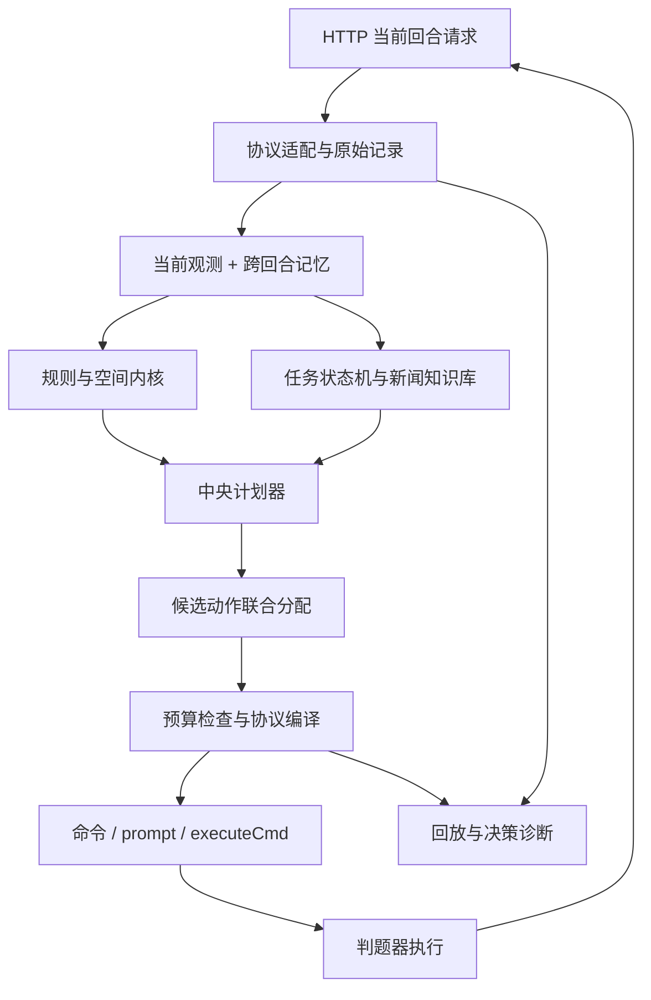
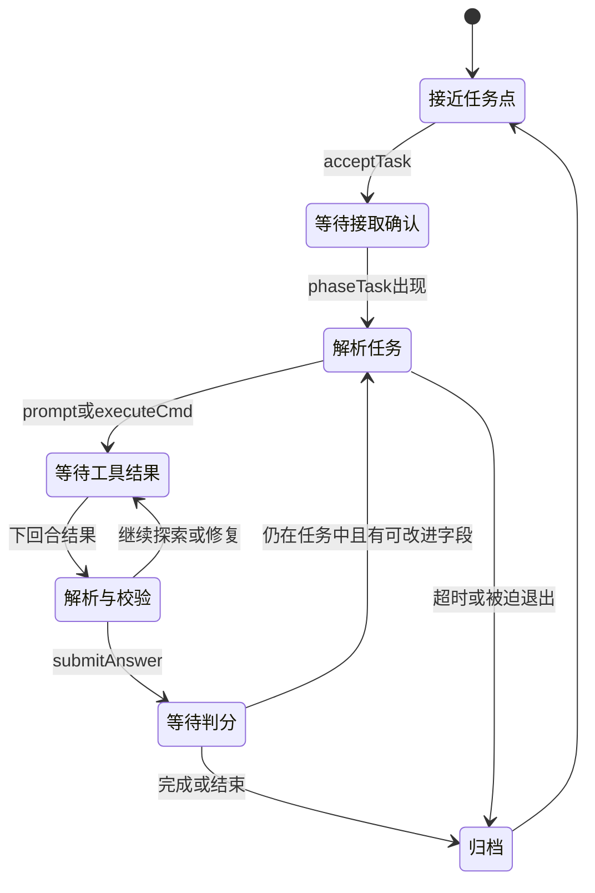

# 自研框架建议

更新：2026-09-14。状态：设计建议；用户已明确自研，但具体模块及技术选择未逐项确认。

## 1. 推荐形态与“最优”的边界

当前最适合这组约束的是一个以 Python 为首版候选、标准库优先的有状态单进程程序：中央调度三个角色，规则内核负责确定计算，LLM／沙盒通过游戏协议组成跨回合任务流程。

这个建议针对小地图、仅三个操作者、5 秒 HTTP 限时、任务允许 Python 沙盒和 demo 已使用 Python 的现状。它不是所有硬件、未知任务分布下的数学全局最优。运行环境和性能画像确认后再决定是否需要原生加速，当前无需为语言切换承担额外集成成本。

不建议把顶层控制交给每角色独立决策、完整大模型行动循环、庞大通用博弈搜索或微服务集群。三个角色共享金币、炮台、通道和时间，小规模联合枚举可以直接解决许多冲突，状态管理成本也更低。

## 2. 数据流

建议保留少量清晰接口：`observe(request)`、`propose(context)`、`allocate(candidates)`、`compile(plan)`。这是接口设计说明，本轮不创建相应代码文件。

## 3. 状态分层

| 对象 | 内容 | 生命周期及规则 |
| --- | --- | --- |
| RawObservation | 完整原始请求、未知字段、哈希 | 每回合留证，不在解析时丢业务信息 |
| Observation | 我敌单位、机器人、任务、价格、结果、新闻 | 当前事实；缺失和数值 0 分开 |
| RuleProfile | 数值、几何、判定语义、证据版本 | 按已验证版本加载；不确定规则保持显式标记 |
| WorldModel | 占格、交互站位、距离图、威胁和可见性 | 从事实与规则推导，可重算 |
| MatchMemory | 计划、上轮动作、任务实例、LLM预算、历史新闻、工具待返回项 | 每半场独立；预期状态与观察状态分开 |
| KnowledgeStore | 已验证任务 SOP、模板、失败样例、宝藏线索 | 首先支持局内复用；跨局持久化权限和环境未确认 |

关键原则：发出了 build 不等于建成，提交答案不等于正确，发出了 prompt 不等于已经得到答案。下一回合使用实际盘面、结果字段和 errors 对账；不能把本地乐观预测覆盖成事实。

`Robot.targetTeam`、种类、眩晕状态必须保留。敌方实体有“当前可见／历史最后可见／已确认消失”区别；不可见的历史位置不直接变成永久障碍，也不直接当成确定空格。

新闻按天原文去重保存，结构化线索必须带原文位置、适用时间和置信度；模型总结不能取代原始传闻。

## 4. 中央计划器：分配工作与动作

计划器产生跨回合工作，例如采矿往返、购买并运送升级券、建墙、值守炮台、完成任务、赶往宝藏。每项工作包含：

`目标、允许角色、前置条件、交互站位集合、预计耗时、资源、截止时间、预期收益、风险、失效条件、占用约束`。

每回合根据新闻变化、昼夜切换、任务进展、矿消失、角色死亡和实际失败重规划。已有工作如果仍合理可以保留，并加入换目标成本，避免两座矿之间来回摇摆；不能让承诺阻止必要的紧急撤回。

白天和夜晚使用不同候选生成器，但共享同一个动作分配器。防守、经济、任务同时存在：夜晚仍可能安全做任务或使用道具，白天也需要规划下一夜的到位和升级。

全队效用可参考“收益增量 − 时间成本 − 风险 − 切换成本”，具体权重通过对局标定。基地、角色存活和任务不可中断条件可作为约束或风险预算，而非各模块各自写一遍绝对优先级。

2026-09-14明确的任务评分应直接进入收益模型：完整完成用 `S+5*T/t`，部分结算用 `S*p`，任务金币仍为 `goldReward*p`。估计期望收益时分别考虑完整完成概率及耗时、未完整完成时的通过率；不要把速度奖励按部分通过率线性分摊。路程不直接进入t，但仍纳入全局时间成本；T缺失时保留未知，不默认成0。

### 联合动作预算

每个候选动作声明消耗：操作者本回合动作、炮台使用权、金币、角色背包物品／空位、建造名额、位置以及工具请求通道。

最终选出的集合必须满足：

- 每名活角色最多一个动作；一次攻击同时预占角色与武器。
- 全部买／建开销不超过当前可用金币；不提前花尚未确认的同回合卖矿收入。
- 材料来自动作执行者背包；购物后的物品归该角色，不能当作全队仓库。
- 武器总数、日召唤数和调用配额符合上限。
- 移动不争目标、不互换；建造不会与其他已选动作的必要站位冲突。
- 当前任务的开拓者若必须驻留，不能被其他模块顺手调回炮台。
- `prompt`、`executeCmd` 每轮各至多一个顶层请求；能否同时使用及返回对应关系按协议实测配置。

三个操作者的简单移动／等待联合动作最多 `9^3=729`。每角色保留少量有价值候选后，其他动作也可用限时枚举或分支限界组合。无需先引入重量级优化器；超过预算随时返回已找到的合法方案。

## 5. 空间、布局与寻路

### 交互目标是站位集合

“去矿点”是去其周围可站立格，“使用基地升级券”是去基地四格周边合法站位，“守炮”是去能操控它且有生存空间的位置。按这些目标集合做 BFS／最短路，不要先按坐标选一个站位再赌路径。

地图只有 1312 格、八方向等成本。首版可用多目标 BFS 计算精确步数；有风险权重时用 Dijkstra／A*。战略路径与当前回合占格分开：远期允许对移动角色采用软代价，最后一步仍做联合冲突检查。

保留顶点预占与方向边预占，防止争格和交换；允许已确认安全的跟随腾挪。对不可见对手及未知机器人移动只提供风险估计，不能承诺所有碰撞都可预测。连续失败需改变站位、路径或目标，而不是重复同一步。

### 炮位与门的选择

若 12 个内圈武器位置成立，选 3 个位置只有 `C(12,3)=220` 种，再考虑三类武器分配最多 `220*3^3=5940` 个初始组合。可在开局或布局变化时筛选，没必要每回合重新全算。

评估必须同时看射程覆盖、弹道、控制者安全格、矿区／任务／商店交通、门的位置、内圈连通和升级后的覆盖。先筛合法且可进出的布局，再按已验证浪潮模型评价。

墙只是障碍和血量资产，不保证能挡住射程 3 的远程攻击。几何连通检查也必须允许斜穿角。换边使用基地相对坐标与实际中立设施位置重算；全局地图和矿分布未必镜像。

### 操作者与炮台分配

三人三炮的完整一一匹配只有 `3!=6` 种，选取时比较到位时间、当前是否能开火、冷却窗口、存活风险和任务机会成本。人数／炮数不足时也枚举部分匹配。

不永久固定“一人一炮”：操作者若站在两炮交叠邻域，可在不同回合切换；火箭冷却期间可以做经验证安全的其他动作。所有安排都受一人一动作约束。

## 6. 战斗候选与局部推演

单独为三类武器实现规则函数：有效落点、攻击方向、命中对象、伤害预算、冷却。加特林用非零方向向量两两点积 `>=0` 检查不超过 90°，避免浮点角度边界；零向量及同坐标重复目标另测。

火箭枚举合法射程内中心，计算 3×3 各机器人的有效伤害与威胁收益。若判题器接受空地落点，候选中心可来自机器人坐标及其八邻格；否则先限定为已确认合法目标。多导弹需要联合考虑伤害饱和，不能逐枚照抄同一贪心中心。

跨炮计划记录总伤害向量，但不把“预估已致死”擅自应用到判题器的中间碰撞／弹道上。己方同回合伤害能否改变后续子弹拦截，要等结算语义验证。保守分支下仍可计算回合末总伤害及溢出。

目标价值综合：基地／操作者威胁、目标阵营、可能击杀分、可避免的后续攻击、天亮剩余时间和消耗成本。最后一夜、最后一轮与普通中盘可以采用不同价值函数。

短期推演先覆盖 1–4 回合的可验证部分。机器人 AI 未知时保留多种可能路径或损伤上界；不先构造一个自认为准确的完整模拟器来训练策略。

## 7. 经济计划

矿点收益按完整物流周期比较：到矿交互位置、采集、到商贩、卖出、购物／返程以及中间风险。参考量是 `净收益 / 占用角色回合数`，不是矿石单价或直线距离。

新闻给出未来供需事件时保存开始日、结束日、受影响矿种和预测；当前交易始终用请求价格。库存留待涨价需要明确比较资金占用、背包占用和可能错失的当夜防守升级。

升级券购买与运送、实际使用是三类不同进度。优先确定谁有空位、谁能到店、谁能在截止前送达目标。升级的恢复价值应计入，而不是永远在满血时立即使用。

预留石头不一定固定为 6：由缺墙数量、返程距离、夜防截止和其他资源需求决定。使用召唤令要把对方获得击杀分的可能性也计入，不能假设花钱给对方加怪必然得利。

## 8. 任务与知识系统

状态机必须区分“请求已发”和“结果已收到”，以任务点、接取回合、任务描述及本地序号关联工具结果。只有文本哈希不够，相同任务描述可能在不同实例重复出现；旧回合结果不能交给新任务。

评分计时分别记录接取请求回合、已确认接取回合、答案提交回合、实际完成回合和结果观察回合；哪些回合能由反馈准确还原按Q02校准。速度分母是实际完成减接取，不能把收到结果的回合直接代入。选定SOP后允许本地解析、校验、生成响应在同一HTTP周期内推进多个内部状态，直到需要外部结果或已用完动作预算；不让“一状态一游戏回合”的实现平白增加等待，也不让一个角色同轮执行接取和提交两条动作。

沙盒结果解析 `[exitCode:N]`、`[TIMEOUT]`、`[JUDGER_ERROR]` 和 `[TRUNCATED]`，将失败执行与错误答案分开。64 KB 截断前应由沙盒程序输出简洁结构化结果；没有拿到完整输出时不能假装验证成功。

任务内采用“识别题型 → 查询已验证 SOP → 必要时 LLM 探索 → 沙盒执行验证 → 提交 → 从反馈修正”。SOP 保存适用任务特征、输入输出、所需环境、已验证案例和失效条件。跨任务复用确定步骤，但新实例的动态数据仍重新查询。

在正确性与生存约束相同时，完整答案准备好且提交合法就应进入候选动作，避免固定延迟或没有信息增益的重复LLM往返。额外校验是否值得做，比较它带来的正确率提升与推迟完成的分值损失 `5*T*k/(t*(t+k))`，而非一律省略校验。

已知题型的本地模板检索、已有知识整理和必要站位准备可尽量安排在接取计时之前；不假设接取前能看到新题全文或使用executeCmd，也不为准备而无代价推迟任务吞吐。它们仍占比赛时间，必须与刷新的30轮冷却和下一夜防守共同规划。

任务奖励可按字段部分计分，因此维护候选答案及已提交证据。缺乏高通过率反馈字段时不能自认为知道最高分答案；记录能观察到的结果与估计即可。

工具通道和 HTTP 请求处理分开：这并不要求在本地启动外部 LLM 子进程。游戏提供的是“本回合提出、下一回合读取”的异步协议，HTTP 处理器快速返回完整响应即可。

宝藏知识库单独维护位置候选、时间条件、物品多重集、线索冲突及已探测结果。结果 2 保留“过早”和“地点错”两种解释；只有明确结果或证据才淘汰候选。出发前校验开拓者背包和返程／任务机会成本。

## 9. 可靠性和可回放性

比赛状态只由一个串行决策入口修改。传输层可以接并发请求，但应将同一比赛状态的提交串行化；日志写入不要阻塞核心决策。

相同会话、相同回合、相同请求哈希返回缓存响应，并且只提交一次本地状态。判题器是否会重复执行响应中的命令无法由本地缓存保证；有副作用的任务命令还需自身幂等设计或结果确认。

同回合不同输入、旧回合迟到、半场重置必须可识别。接口没有 matchId，不应单凭“roundNo 变小”就无条件清空状态；结合实际进程生命周期、阵营身份及初始状态识别，并向主办方确认重试与换场行为。

输出统一由 ActionCompiler 生成，负责 JSON 结构、字段、目标数、角色类型、距离、预算、背包、配额和冲突检查。校验应区分“确定非法”与“可能因对手行动而失败”，不因未知风险把所有有效动作都过滤掉。

保底分层：正常联合计划 → 已验证的简单防守／待机 → 完整协议空动作。可选搜索接近截止就停，不等待 LLM。内部软截止可先保留到 3.5 秒以内作为上限设计，正常路径目标远低于此；这只是预算建议，最终需目标机压测。

每轮记录输入、输出、规则版本、计划 ID、选择原因、被拒动作原因、估计与实际差异、耗时和错误分类。回放首先验证我方选择与状态演进，不冒充官方完整模拟器。

## 10. 后续实施顺序与验收

| 阶段 | 交付内容 | 验收依据 |
| --- | --- | --- |
| P0 规则与协议核对 | 解决高优先级 Q 项，真实请求与响应样本 | 采用已明确计分公式，核验其边界；确认结算、建造区、超时和任务通道 |
| P1 最小可靠自研骨架 | 完整观测、状态、日志、动作编译和回放 | 无格式异常；重复输入不重复扣本地预算；B01–B06 对应边界不再遗漏 |
| P2 空间与联合控制 | 站位集合、路径、资源预占、炮手分配、返程 | 钱不超支、角色不重复占用、避免已知冲突、到位能开火 |
| P3 任务闭环与经济并行 | accept/工具/submit 状态机、SOP、采卖买用 | 至少跑通真实任务与一次完整升级物流；不能长期推迟任务能力 |
| P4 战斗与布局优化 | 武器模型、溅射选点、短期推演、布局候选 | 对官方回放校准伤害及结果，比较合法动作率、有效伤害、存活与收益 |
| P5 新闻宝藏与对抗 | 历史线索、宝藏路线、召唤／干扰策略 | 有条件收益和真实对局证据，记录失败与反例 |

评估先看协议异常数、失败动作类型、夜间缺岗、资源闲置和任务完成率，再看基地存活回合、任务速度、击杀分与上下半场胜率。原版 demo 只是最低基线，还要比较不同策略配置与多种对手；现有材料不足以设定可信的最终胜率目标。

任务诊断额外记录基础分、速度项、部分通过率、接取至完成轮数、工具往返次数、可消除空等轮数，以及预期分与实际总分变化的差异。得分同时叠加击杀或生存结算时，不能把全部总分增量误归到任务。
