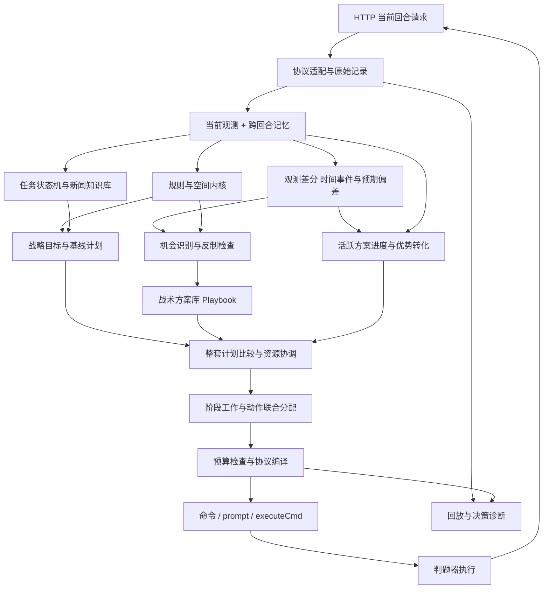
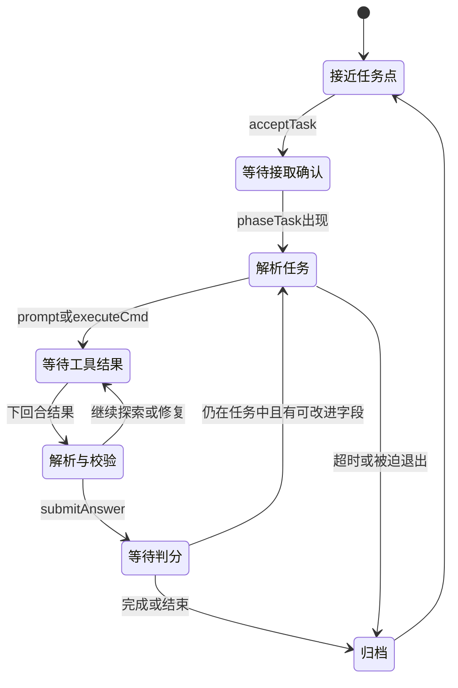

# 自研框架设计

更新：2026-09-14。状态：目标架构。已实现盘面记忆、空间与动作校验、候选调度及基础Playbook；任务闭环和高级策略待实现，效用权重、风险预测和部分规则仍需校准。

## 1. 推荐形态与“最优”的边界

当前最适合这组约束的是一个以 Python 为首版候选、标准库优先的有状态单进程程序：中央调度三个角色，规则内核负责确定计算，LLM／沙盒通过游戏协议组成跨回合任务流程。

核心扩展入口是“机会识别器 + 战术方案库Playbook + 跨回合执行与优势转化”，支持快速增补打法、根据新观测修正判断和切换方案，中央分配器统一协调资源。完整契约见[opportunity-playbooks.md](opportunity-playbooks.md)。

这个建议针对小地图、仅三个操作者、5 秒 HTTP 限时、任务允许 Python 沙盒和 demo 已使用 Python 的现状。它不是所有硬件、未知任务分布下的数学全局最优。运行环境和性能画像确认后再决定是否需要原生加速，当前无需为语言切换承担额外集成成本。

不建议把顶层控制交给每角色独立决策、完整大模型行动循环、庞大通用博弈搜索或微服务集群。三个角色共享金币、炮台、通道和时间，小规模联合枚举可以直接解决许多冲突，状态管理成本也更低。

### 关键取舍

| 取舍 | 依据与复核条件 |
| --- | --- |
| 新建框架，demo只作参考和基线 | 现有解析器和调度方式缺失任务、历史及共享预算；保留设计原则，不继承其业务结构 |
| 单一状态提交入口，统一动作编译 | 三名角色相互依赖，不能让各打法覆盖命令或重复花钱 |
| 规则内核负责确定计算，LLM／沙盒负责语义任务 | 工具结果经过关联和校验才进入行动，已知高频模式不等待LLM |
| 任务会话与历史状态进入早期闭环 | 解题驻留、异步结果及任务速度分都依赖跨回合状态，不能最后补接 |
| 先做局部模型与回放，再扩展搜索 | 判题器语义未齐全；未知部分使用显式假设，避免用错误模拟器得出胜率结论 |

Utility权重、风险阈值、预测精度和性能预算按证据标定；结算顺序、建造边界、任务记账及进程生命周期等未决项统一维护在[Q清单](pitfalls-and-boundaries.md)。

## 2. 数据流

对外循环保留少量清晰接口：`observe(request)`、`propose(context)`、`allocate(candidates)`、`compile(plan)`。内部propose支持机会检测和整套Playbook候选，allocate支持阶段需求与可撤销预留，不能仅比较单步动作。

分层是职责边界，不要求每层独立服务。已知策略当轮触发、赛间增补策略、局中更新代码是不同能力；后者取决于比赛环境和版本迁移约束。

## 3. 状态分层

| 对象 | 内容 | 生命周期及规则 |
| --- | --- | --- |
| RawObservation | 完整原始请求、未知字段、哈希 | 每回合留证，不在解析时丢业务信息 |
| Observation | 我敌单位、机器人、任务、价格、结果、新闻 | 当前事实；缺失和数值 0 分开 |
| RuleProfile | 数值、几何、判定语义、证据版本 | 按已验证版本加载；不确定规则保持显式标记 |
| WorldModel | 占格、交互站位、距离图、威胁和可见性 | 从事实与规则推导，可重算 |
| MatchMemory | 计划、上轮动作、任务实例、LLM预算、历史新闻、工具待返回项 | 每半场独立；预期状态与观察状态分开 |
| Opportunity | 破绽证据、目标绑定、窗口、反制假设、置信度 | 随观察更新并过期，不能用不可见等同敌方不存在 |
| PlaybookRun | 打法ID与版本、当前阶段、资源预留、实际进度、后续分支 | 跨回合持续；由实际结果推进，不随本轮局部小收益任意改写 |
| KnowledgeStore | 已验证任务 SOP、模板、失败样例、宝藏线索 | 首先支持局内复用；跨局持久化权限和环境未确认 |

关键原则：发出了 build 不等于建成，提交答案不等于正确，发出了 prompt 不等于已经得到答案。下一回合使用实际盘面、结果字段和 errors 对账；不能把本地乐观预测覆盖成事实。

`Robot.targetTeam`、种类、眩晕状态必须保留。敌方实体有“当前可见／历史最后可见／已确认消失”区别；不可见的历史位置不直接变成永久障碍，也不直接当成确定空格。

新闻按天原文去重保存，结构化线索必须带原文位置、适用时间和置信度；模型总结不能取代原始传闻。

## 4. 中央计划器：分配工作与动作

### 从机会到持续战术

战略层保留可执行的基线经营／防守计划。机会检测器提出带证据和时窗的打法候选，PlanArbiter将它们与正在执行的打法及基线一起比较，按阶段分配必要角色与资源。兼容的打法可以并行，不要求一次接管全部三名角色。

PlaybookRun按阶段产生Jobs，声明触发、安全、完成和退出条件。每轮先对账、更新证据，再联合比较续打、内部变招、换打法和基线，只提交当前回合动作。交接保留真实资产和任务状态，不保留已失效判断；关键前提失效可以打断，小幅估值波动则避免反复横跳。事件批量处理、生命周期及收益核对详见[Playbook契约](opportunity-playbooks.md)§7。

### 工作描述

计划器产生跨回合工作，例如采矿往返、购买并运送升级券、建墙、值守炮台、完成任务、赶往宝藏。每项工作包含：

`目标、允许角色、前置条件、交互站位集合、预计耗时、资源、截止时间、预期收益、风险、失效条件、占用约束`。

命名上将这类通用工作称为 `Job`，规则中已接取的自进化任务称为 `ChallengeSession`。执行解题可以由一个Job承担，但会话单独维护接取、驻留、工具请求、答案、计分和结束状态；不能把解题状态压成一个普通采矿式目标。

每回合根据新闻变化、昼夜切换、任务进展、矿消失、角色死亡和实际失败重规划。已有工作如果仍合理可以保留，并加入换目标成本，避免两座矿之间来回摇摆；不能让承诺阻止必要的紧急撤回。

白天和夜晚使用不同候选生成器，但共享同一个动作分配器。防守、经济、任务同时存在：夜晚仍可能安全做任务或使用道具，白天也需要规划下一夜的到位和升级。

全队效用可参考“收益增量 − 时间成本 − 风险 − 切换成本”，具体权重通过对局标定。基地、角色存活和任务不可中断条件可作为约束或风险预算，而非各模块各自写一遍绝对优先级。

战略层统一下发评估截止回合、比较基线、预算及估值配置。候选返回可解释的收益与状态分量，不自行制造不可比较的总分；游戏Score与内部Utility分开。不同耗时路线按共同截止点比较后续经营和剩余价值，现金转成升级资产、并行方案共享收益等情况禁止重复计入。具体契约见Playbook文档§8。

如果引入ECONOMY/DEFEND等战略模式，模式用于调整目标权重、预算和候选数量；不能因全队选了DEFEND就排除安全解题或购物。模式切换设置收益改善门槛／切换成本，危及基地或角色时允许立即打断。确定事实、紧急规则与效用比较共同工作，不追求消灭所有if分支。

任务评分直接进入收益模型：完整完成用 `S+5*T/t`，部分结算用 `S*p`，任务金币为 `goldReward*p`。估计期望收益时分别考虑完整完成概率及耗时、未完整完成时的通过率；不要把速度奖励按部分通过率线性分摊。路程不直接进入t，但仍纳入全局时间成本；T缺失时保留未知，不默认成0。

### 角色—工作矩阵与候选比较

先构建每个角色执行每个Job的可行性和效用分解：可到达站位、角色能力、到位与完成ETA、截止余量、所需资源、收益、风险及切换成本。确定不可能的组合直接标为不可选，不用一个“很大负分”假装硬约束。现金、HP、轮数与游戏积分分开保存，转换权重需解释和标定。

矩阵可产生完整或部分匹配候选，但不能直接按行各取最大，也不能假设普通一一匹配已经解决共享金币、炮台、站位与协同伤害。Job声明容量：同一建造目标通常独占，同一矿区可容纳多个具有合法站位的工人；联合分配器继续检查下面的共享预算及动作组合效应。

最小算例：两个各需一人的工作A/B，到位成本如下，没有其他共享约束。

| 角色 | 工作A | 工作B |
| --- | --- | --- |
| 角色1 | 1 | 2 |
| 角色2 | 1 | 4 |

角色1先取最近的A会使总成本为5；联合分配角色1→B、角色2→A则为3。两种匹配已做数学枚举核对，这不是实测游戏路线，也不表示矿区应被限制为一人容量。

先估计站位和路径再评分，分配后做联合移动细化；若发现争格、不可到位或资源冲突，将原因反馈给分配器重新选候选，不能只在末尾删掉冲突动作而浪费整个人的回合。保留等待／安全替代候选以保证有解。

### 联合动作预算

每个候选动作声明消耗：操作者本回合动作、炮台使用权、金币、角色背包物品／空位、建造名额、位置以及工具请求通道。

最终选出的集合必须满足：

- 每名活角色最多一个动作；一次攻击同时预占角色与武器。
- 全部买／建开销不超过当前可用金币；不提前花尚未确认的同回合卖矿收入。
- 材料来自动作执行者背包；购物后的物品归该角色，不能当作全队仓库。
- 武器总数、日召唤数和调用配额符合上限。
- 移动不争目标、不互换；建造不会与其他已选动作的必要站位冲突。
- 当前任务的开拓者若必须驻留，不能被其他模块顺手调回炮台。
- `prompt`、`executeCmd` 每轮各至多一个顶层请求；能否同时使用及返回对应关系按协议实测配置。

三个操作者的简单移动／等待联合动作最多 `9^3=729`。每角色保留少量有价值候选后，其他动作也可用限时枚举或分支限界组合。无需先引入重量级优化器；超过预算随时返回已找到的合法方案。

新增打法模块只读取上下文并返回候选，不直接修改roleCommandMap或扣减共享金币。只有统一协调器选择方案与提交运行状态，编译层生成协议；此读写边界用于防止打法越加越多后重新出现决策耦合与隐式覆盖。

## 5. 空间、布局与寻路

### 交互目标是站位集合

“去矿点”是去其周围可站立格，“使用基地升级券”是去基地四格周边合法站位，“守炮”是去能操控它且有生存空间的位置。按这些目标集合做 BFS／最短路，不要先按坐标选一个站位再赌路径。

地图只有 1312 格、八方向等成本。首版可用多目标 BFS 计算精确步数；有风险权重时用 Dijkstra／A*。战略路径与当前回合占格分开：远期允许对移动角色采用软代价，最后一步仍做联合冲突检查。

### 空间数据分层与缓存

| 数据层 | 内容 | 使用边界 |
| --- | --- | --- |
| StaticBlocked | 建筑完整占格、中立设施、当前矿区等 | 建筑毁／造、矿消失／刷新时失效 |
| OccupancyNow | 当前可见角色、机器人与已选动作占位 | 每回合从观察重建，保留阵营与可见性 |
| Danger(role,pos,offset) | 给定角色与未来轮次的受伤／被堵风险 | 考虑HP、机器人目标阵营、眩晕和多种可能轨迹；未知不写成精确值 |
| FireCoverage | 炮位射程、弹道、冷却及可用操作者 | 理论射程和本轮可开火覆盖分别保存；无炮手不能按安全区抵扣风险 |
| DistanceField | 到目标交互站位集合的最短步数或代价 | 注明依据静态障碍还是当轮占格，不能把下界当可保证到位时间 |

等成本路径的距离场可以供多个候选复用。缓存键至少包含地图尺寸、障碍／拓扑版本、目标站位集合以及移动规则；若代价含风险或拥堵，还包括对应版本和角色／时间条件。只按“目标坐标”缓存会在矿刷新、墙变化或炮手死亡后误用旧结果。

首版路径边成本采用 `1 + 非负风险代价 + 非负拥堵代价`。火力支援降低预估危险，不形成每经过一格就领取的负奖励；从而保持Chebyshev为步数成本下界。需要多步累计风险时记录角色条件和时间维度，不能把所有角色共用的一张固定热力图当真实伤害预测。

保留顶点预占与方向边预占，防止争格和交换；允许已确认安全的跟随腾挪。对不可见对手及未知机器人移动只提供风险估计，不能承诺所有碰撞都可预测。连续失败需改变站位、路径或目标，而不是重复同一步。

未来2–3回合的预留可作为首版候选：下一步在当前已选计划内是硬约束，更远的预留是带角色、Job、计划版本的可撤销协作预期。每次新观察到位失败、矿消失、角色死亡或紧急工作插入时重算相关预留。不能把未来格子锁成永久障碍，也不能认定对手会配合预留。

优先规划可先按防守截止、驻留约束与紧急程度排序；发生阻塞时尝试换顺序、让路或小规模联合枚举，而非固定角色ID永远优先，避免饥饿。3人仍以联合合法性检查为最终依据，无需一开始部署复杂完整MAPF求解器。

MotionPlanner可返回路径、ETA及可解释的失败原因供评估与协作使用，执行层仍只下发当前回合的一步。保留路径不等于强制沿旧路径走，每轮重新核对当前观察。

### 炮位与门的选择

若 12 个内圈武器位置成立，选 3 个位置只有 `C(12,3)=220` 种，再考虑三类武器分配最多 `220*3^3=5940` 个初始组合。可在开局或布局变化时筛选，没必要每回合重新全算。

评估必须同时看射程覆盖、弹道、控制者安全格、矿区／任务／商店交通、门的位置、内圈连通和升级后的覆盖。先筛合法且可进出的布局，再按已验证浪潮模型评价。

墙只是障碍和血量资产，不保证能挡住射程 3 的远程攻击。几何连通检查也必须允许斜穿角。换边使用基地相对坐标与实际中立设施位置重算；全局地图和矿分布未必镜像。

### 操作者与炮台分配

三人三炮的完整一一匹配只有 `3!=6` 种，选取时比较到位时间、当前是否能开火、冷却窗口、存活风险和任务机会成本。人数／炮数不足时也枚举部分匹配。

不永久固定“一人一炮”：操作者若站在两炮交叠邻域，可在不同回合切换；火箭冷却期间可以做经验证安全的其他动作。所有安排都受一人一动作约束。

已实现夜间／临近入夜的接近、守位和开火候选共享准备价值，守位预占操作员与炮台但不输出协议动作；这修复了无目标时到位价值消失导致的往返。已有三炮不代表具备三名可用操作员，任务中的开拓者也不能无成本调离。完整“牺牲本轮开火换取后续覆盖”的收益比较仍需短期火力预测与真实敌情校准，不能靠固定要求三炮齐射或无条件禁用开拓者代替。

## 6. 战斗候选与局部推演

单独为三类武器实现规则函数：有效落点、攻击方向、命中对象、伤害预算、冷却。加特林用非零方向向量两两点积 `>=0` 检查不超过 90°，避免浮点角度边界；零向量及同坐标重复目标另测。

火箭枚举合法射程内中心，计算 3×3 各机器人的有效伤害与威胁收益。若判题器接受空地落点，候选中心可来自机器人坐标及其八邻格；否则先限定为已确认合法目标。多导弹需要联合考虑伤害饱和，不能逐枚照抄同一贪心中心。

跨炮计划记录总伤害向量，但不把“预估已致死”擅自应用到判题器的中间碰撞／弹道上。己方同回合伤害能否改变后续子弹拦截，要等结算语义验证。保守分支下仍可计算回合末总伤害及溢出。

目标价值综合：基地／操作者威胁、目标阵营、可能击杀分、可避免的后续攻击、天亮剩余时间和消耗成本。最后一夜、最后一轮与普通中盘可以采用不同价值函数。

短期推演先覆盖 1–4 回合的可验证部分。机器人 AI 未知时保留多种可能路径或损伤上界；不先构造一个自认为准确的完整模拟器来训练策略。

对机会型打法，短期预测重点回答“来得及利用吗、对方最快如何补救、我方会失去什么”。跨日扩大优势则用Playbook阶段、任务／资金里程碑和截止时间规划；局部1–4轮搜索不是整套运营计划的寿命上限。仅预测常见应对时标为高把握机会，不能宣称已排除所有合法反制而保证终局胜利。

## 7. 经济计划

矿点收益按完整物流周期比较：到矿交互位置、采集、到商贩、卖出、购物／返程以及中间风险。参考量是 `净收益 / 占用角色回合数`，不是矿石单价或直线距离。

新闻给出未来供需事件时保存开始日、结束日、受影响矿种和预测；当前交易始终用请求价格。库存留待涨价需要明确比较资金占用、背包占用和可能错失的当夜防守升级。

升级券购买与运送、实际使用是三类不同进度。优先确定谁有空位、谁能到店、谁能在截止前送达目标。升级的恢复价值应计入，而不是永远在满血时立即使用。

预留石头不一定固定为 6：由缺墙数量、返程距离、夜防截止和其他资源需求决定。使用召唤令要把对方获得击杀分的可能性也计入，不能假设花钱给对方加怪必然得利。

## 8. 任务与知识系统

状态机必须区分“请求已发”和“结果已收到”，以任务点、接取回合、任务描述及本地序号关联工具结果。只有文本哈希不够，相同任务描述可能在不同实例重复出现；旧回合结果不能交给新任务。

评分计时分别记录接取请求回合、已确认接取回合、答案提交回合、实际完成回合和结果观察回合；哪些回合能由反馈准确还原按Q02校准。速度分母是实际完成减接取，不能把收到结果的回合直接代入。选定SOP后允许本地解析、校验、生成响应在同一HTTP周期内推进多个内部状态，直到需要外部结果或已用完动作预算；不让“一状态一游戏回合”的实现平白增加等待，也不让一个角色同轮执行接取和提交两条动作。

沙盒结果解析 `[exitCode:N]`、`[TIMEOUT]`、`[JUDGER_ERROR]` 和 `[TRUNCATED]`，将失败执行与错误答案分开。64 KB 截断前应由沙盒程序输出简洁结构化结果；没有拿到完整输出时不能假装验证成功。

任务内采用“识别题型 → 查询已验证 SOP → 必要时 LLM 探索 → 沙盒执行验证 → 提交 → 从反馈修正”。SOP 保存适用任务特征、输入输出、所需环境、已验证案例和失效条件。跨任务复用确定步骤，但新实例的动态数据仍重新查询。

在正确性与生存约束相同时，完整答案准备好且提交合法就应进入候选动作，避免固定延迟或没有信息增益的重复LLM往返。额外校验是否值得做，比较它带来的正确率提升与推迟完成的分值损失 `5*T*k/(t*(t+k))`，而非一律省略校验。

已知题型的本地模板检索、已有知识整理和必要站位准备可尽量安排在接取计时之前；不假设接取前能看到新题全文或使用executeCmd，也不为准备而无代价推迟任务吞吐。它们仍占比赛时间，必须与刷新的30轮冷却和下一夜防守共同规划。

任务奖励可按字段部分计分，因此维护候选答案及已提交证据。缺乏高通过率反馈字段时不能自认为知道最高分答案；记录能观察到的结果与估计即可。

工具通道和 HTTP 请求处理分开：这并不要求在本地启动外部 LLM 子进程。游戏提供的是“本回合提出、下一回合读取”的异步协议，HTTP 处理器快速返回完整响应即可。

宝藏知识库单独维护位置候选、时间条件、物品多重集、线索冲突及已探测结果。结果 2 保留“过早”和“地点错”两种解释；只有明确结果或证据才淘汰候选。出发前校验开拓者背包和返程／任务机会成本。

## 9. 可靠性和可回放性

比赛状态只由一个串行决策入口修改。传输层可以接并发请求，但应将同一比赛状态的提交串行化；日志写入不要阻塞核心决策。

相同会话、相同回合、相同请求哈希返回缓存响应，并且只提交一次本地状态。判题器是否会重复执行响应中的命令无法由本地缓存保证；有副作用的任务命令还需自身幂等设计或结果确认。

同回合不同输入、旧回合迟到、半场重置必须可识别。接口没有 matchId，不应单凭“roundNo 变小”就无条件清空状态；结合实际进程生命周期、阵营身份及初始状态识别，并向主办方确认重试与换场行为。

输出统一由 ActionCompiler 生成，负责 JSON 结构、字段、目标数、角色类型、距离、预算、背包、配额和冲突检查。校验应区分“确定非法”与“可能因对手行动而失败”，不因未知风险把所有有效动作都过滤掉。

保底分层：正常联合计划 → 已验证的简单防守／待机 → 完整协议空动作。可选搜索接近截止就停，不等待 LLM。内部软截止可先保留到 3.5 秒以内作为上限设计，正常路径目标远低于此；这只是预算建议，最终需目标机压测。

检测器和候选评估共享该总预算，为最终校验和响应留出余量；不能把单候选预算逐项累加到超出整回合时限。先准备当前可用的已校验保底方案，可选计算必须有界或支持截止检查；外层异常捕获不能中断任意阻塞函数。对大量机会同时触发的情况单独压测，未评估项需记录，不冒称全部机会都已比较。

每轮记录输入、输出、规则版本、计划 ID、选择原因、被拒动作原因、估计与实际差异、耗时和错误分类。回放首先验证我方选择与状态演进，不冒充官方完整模拟器。

当前实现提供在线stdout事件日志与离线JSONL回放，均使用白名单摘要，默认不保存任务内容；原始输入／输出留在忽略目录，不自动落盘或提交。在线事件以请求ID关联到达与完成，包含版本指纹、HTTP结果、输入形状、角色／资源摘要、选中动作、任务通道长度、空动作原因和搜索拒绝计数。日志通过256条有界队列异步逐条刷新，队列满时丢弃并在恢复后报告，不让stdout写入阻塞决策线程；强杀不保证尾部日志完整。字段与排障流程见[平台日志](../../README.md#平台日志)。

离线摘要额外核对证据标签、资源预留、估值、预测角色死亡、动作失败、状态交接及实际金币净变化。搜索拒绝统计是组合检查计数，不是每个未选候选的完整因果解释；`buildCheck`也仅覆盖建造的基础门槛。没有官方模拟器，不能由日志推断胜率或将HTTP成功当作动作成功。相邻两轮有明确失败回执时才累计执行失败；同一移动／采集／建造／交易连续失败后暂退避3轮，成功或相关地图变化会释放证据，不永久判定矿脉枯竭或动作非法。

## 10. 后续实施顺序与验收

已落地工程位于[CoreGeek](../../CoreGeek/main3.py)，启动、测试及打包见[仓库README](../../README.md)。已有回执与基础策略状态、联合校验、打法交接和通用任务会话；完整回放系统、已验证任务SOP及更深入预测仍按以下阶段验收。

任务基线通过构造场景验证接取→LLM→沙盒→再次LLM→提交的闭环。LLM回执携带请求标识，命令包装器输出关联标记；旧结果不直接推进新请求，错误／截断原样交给求解阶段判断，标记不代表执行成功。每实例默认最多12次工具请求，等待3轮仍无关联结果则重新求证，不盲目重发有副作用命令；预算耗尽后停止工具直到任务结束。命令包装器依赖沙盒提供POSIX shell及`python`，尚需Q08真实环境核验。当前禁用任务外LLM调用；任务消失只代表会话结束，不自动宣称满分或推广SOP。

任务预算同时计算LLM与命令。执行前预留一次后续LLM请求，避免最后一次预算花在命令上、得到结果却无法收尾；已发出的最后一次LLM回复仍可转换为答案动作。连续两次同命令且输出相同后，第三次重复请求改为要求换方法；仅移除关联标记后比较结果，不把同长度命令误判为相同，不把变化的有效输出误判为空转。诊断只暴露任务内命令序号、次数、退出码／超时／截断、关联状态及重建原因；不暴露任务和工具正文。止损不自动宣称无解、退出任务或捏造答案。

经济基线会按可观察售价、背包与完整采购／交付路径提出升级投资。购券、运券、使用分回合执行；已观察到有人持有同类券时不继续重复采购。采购尚未开始也要预留金币，当轮实际支出与未来预留合并校验，不预支卖矿收入。升级资产、修复与占用时间的权重仍是待标定估值，并非已证明的最佳投资组合。

炮位保持属于独立的全队战略约束，不内嵌进卖矿等打法。夜间基地附近6格内有未眩晕的己方来犯机器人时，基线在角色生存约束后优先不减少已有到位炮位，再比较效用；一人不能被计为同时看守两炮。联合换岗可以保留覆盖并释放原炮手，狭窄单格炮位支持以同伴同轮让位为前提提出路线，最终由联合动作校验确认。到位只是下轮站位准备，不等同于本轮已开火或已获得保护；阈值和同轮跟随结算均须校准，提供`preserve_threatened_posts`、`joint_follow_moves`开关。

短期保护使用`ThreatEnvelope`：暂按可见敌对机器人移动一格并攻击一次估算，不因预计击杀或墙体就消除反击。调度先最小化该模型下角色死亡数，再最大化普通效用；`RuleProfile.guard_projected_role_deaths`可关闭这项策略假设。保护不等于完整基地生存约束，也不证明机器人必定选择该角色。低血药剂、减小暴露的合法撤步会参与同一次联合搜索；任务中的开拓者只能在可确认的同一驻留区内避让，不自动承担未知退任务代价。

建造的结构性通路保护位于联合调度，不把“合法但布局差”混称为协议非法。基线要求保留各角色原先能到达的基地／武器、商店、矿种及任务点交互区域，新武器仍须有角色可接近；同轮全部建造一起检查。`RuleProfile.preserve_build_access`可关闭此策略约束。范围道具独立注册为Playbook，炸弹与枪炮合并伤害、击杀仅计一次，眩晕覆盖预占防止重复控制；覆盖集合必须同时区分双方机器人，避免漏算误帮对手减压的代价。道具库存仍有未来用途，使用不是无成本动作。

| 阶段 | 交付内容 | 验收依据 |
| --- | --- | --- |
| P0 规则与协议核对 | 解决高优先级 Q 项，真实请求与响应样本 | 采用已明确计分公式，核验其边界；确认结算、建造区、超时和任务通道 |
| P1 最小可靠自研骨架 | 完整观测、状态、日志、动作编译和回放 | 无格式异常；重复输入不重复扣本地预算；B01–B06 对应边界不再遗漏 |
| P2 空间、联合控制与首套Playbook | 站位集合、路径、资源预占、炮手分配、返程；一套机会检测—分阶段执行—确认结果—退出／转化闭环 | 钱不超支、角色不重复占用；打法当轮触发、跨轮延续、失效可撤回；新增第二套不改主循环 |
| P3 任务闭环与经济并行 | accept/工具/submit 状态机、SOP、采卖买用 | 至少跑通真实任务与一次完整升级物流；不能长期推迟任务能力 |
| P4 战斗与布局优化 | 武器模型、溅射选点、短期推演、布局候选 | 对官方回放校准伤害及结果，比较合法动作率、有效伤害、存活与收益 |
| P5 新闻宝藏与对抗 | 历史线索、宝藏路线、召唤／干扰策略 | 有条件收益和真实对局证据，记录失败与反例 |
| P6 提交验收与参考代码退场 | 完整功能回归、目标镜像／网站验证，移除Demo | 自研边界测试已独立覆盖，文档引用已迁移，提交包不依赖demo；不在功能未完成时提前删除 |

评估先看协议异常数、失败动作类型、夜间缺岗、资源闲置和任务完成率，再看基地存活回合、任务速度、击杀分与上下半场胜率。原版 demo 只是最低基线，还要比较不同策略配置与多种对手；现有材料不足以设定可信的最终胜率目标。

任务诊断额外记录基础分、速度项、部分通过率、接取至完成轮数、工具往返次数、可消除空等轮数，以及预期分与实际总分变化的差异。得分同时叠加击杀或生存结算时，不能把全部总分增量误归到任务。

Playbook诊断记录机会首次可见回合、首次识别／采取动作回合、误触发、错失窗口、资源冲突、阶段中断原因、优势兑现率和后续转化收益。验收不仅看某轮选靶是否更好，还看新增打法的改动范围与整条路线能否稳定执行。
