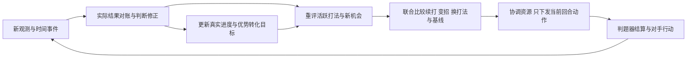

# 机会识别、战术方案与优势转化

日期：2026-09-14。状态：围绕用户核心意图补充的设计规格，尚未实现代码。

## 1. 核心目标

用户最重视的能力是：看到对手位置、行动或布局中的破绽，迅速选用已经掌握的针对性打法，在窗口内获取优势，再按对手反应持续运营，把优势转化为胜利。新发现的打法应能快速加入，而不需要重写中央决策循环。

这将机会驱动的战术方案库提升为框架的核心扩展入口。原有世界模型、联合分配、任务会话和协议校验继续提供支撑，但仅有逐回合Utility打分和通用Job分配还不够：它们需要能表达跨回合计划，同时允许新证据修正判断、改分支或接入另一套标准解法。

用户进一步明确：即使当前认为已经形成胜势，对手仍可能用未预计的应对翻转局面；系统必须及时承认前提变化，并在后续观察到新机会时采用新的标准解法。核心是“事件驱动的滚动决策”，不是选中一个剧本就执行到底。持续的是争胜目标、真实进度和可复用经验，不是对原打法的无条件承诺。

一套打法的价值可以来自对手失误，也可以来自任务SOP、宝藏时机、新闻价格等已知规律。框架应复用这些可识别、可执行、可验证的经验。

## 2. 一套打法的完整生命周期

这里的打法称为Playbook；一次具体执行称为PlaybookRun。PlaybookRun可以产生多个Job，并引用一个已有ChallengeSession。Job描述谁去做什么，Playbook描述这些工作为何组合、以什么顺序执行、对手变化后如何调整。

例如一个已验证套路可以包含“抢到唯一资源 → 确认金币到账 → 安排购买与运送升级券 → 在安全时机升级 → 腾出角色做更高收益任务”。后续步骤须依据真实状态推进，不因预计会得钱就提前购物。

## 3. 三种不同的“快”

| 能力 | 设计目标 | 实现边界 |
| --- | --- | --- |
| 已知打法实时触发 | 新观测出现满足条件的机会，就在本回合候选中评估并采取首步 | 游戏粒度是一回合一次响应，不能在未知对手同轮动作之后再插一次操作；不默认等LLM |
| 快速加入新打法 | 基于已有特征、行动与阶段原语，增加一份打法定义及相应回放样例即可接入 | 不改HTTP、主循环或其他打法；需要新规则／特征时仍需扩展相应模块 |
| 对局进行中更新打法 | 若比赛环境允许，在回合边界切换完整、已校验的定义版本 | 现有接口没有保证允许外部热更新；不依赖重启进程，不假设能从外网下发代码 |

基础版本启动前加载已验证打法，局内使用该库实时发现机会。局内还可以按现有原语组合新计划；“在线组合计划”与“运行中修改程序代码”是不同能力。

热更新若被环境允许，应保持版本原子切换。已经执行到一半的PlaybookRun绑定原定义版本，只有有明确迁移方式才换新版本；不能更新文件后直接把旧阶段编号当成新阶段继续跑。暂不为此创建额外管理服务或开放接口。

## 4. Playbook需要声明什么

| 字段组 | 必须表达的内容 |
| --- | --- |
| 身份与规则 | 稳定ID、版本、适用RuleProfile、依赖的特征与行动原语 |
| 机会检测 | 当前事实、历史模式、证据来源与新鲜度、目标绑定、触发窗口 |
| 成功依据 | 预期获得什么、耗时上界、哪些前提可直接观察、哪些只是推断 |
| 对手反制 | 最快回防、其他可用操作者、换阵、道具、资源和其他可能行动；未知条件要保留 |
| 团队需求 | 角色、炮台、金币、背包物品、站位、各阶段预算、必须留下的防守能力 |
| 执行策略 | 阶段、当前阶段产生的Jobs、观察后转移条件、对手变化时的分支、可中断点与交接状态 |
| 重评依赖 | 依赖哪些事实／推断、预期反馈及期限；哪些事件更新估值，哪些事件直接推翻成立前提 |
| 优势转化 | 得手后投向什么、如何继续扩大收益、何时停止冒险进入守成 |
| 中止与恢复 | 哪些条件必须立即撤回、已消耗与尚未消耗资源分别如何处理、恢复哪个基线计划 |
| 验证资料 | 应触发、不应触发、对手补救、资源冲突、超时与版本变化等回放样例 |

“检查敌人站位后发一条attack”只是一种局部动作规则。完整Playbook还必须说明如果首步没有成功、目标退开、我方受威胁，下一轮应采取什么分支。

## 5. 事实、破绽和胜势不能混为一项

机会识别先输出事实和证据，再推导窗口。例如“当前可见的某角色离炮台很远”是事实；“对方至少n轮无法恢复这座炮的操控”还要求排除其他操作者；“因此我方能赢”又需要一条可执行路线和对反制的判断。

当前接口的敌方信息主要是可见单位，没有完整的对方金币、任务进度及保证完整的背包信息。看不见角色不能认定他已离家或死亡；只看到一个炮手离开，也不能认定对方无人接替。以历史推断的策略需有置信度和过期条件。

建议分开记录：

- **已证条件收益**：在列明且已满足的前提下，能保证某个局部目标或资源增量。
- **高把握战术机会**：主线和常见反制都被检查，但仍有隐藏信息或未建模行为。
- **待验证假说**：值得进入离线对局或有限风险探索，不标成必胜套路。
- **已证制胜条件**：已验证规则下，对所有仍可能的隐藏状态和合法反制，存在持续可行的应对策略保证最终胜利。结论必须限定其状态范围，不能从一轮局部收益外推。

判断窗口时，通常需要“我方完成目标的保守耗时上界 < 对方最早有效反制的时间下界”。后者不只是走回家的距离：可能还有另一名角色、可远程使用的物品或其他补救方式。若不能约束这些反制，结论保持为高把握机会。

目前没有官方裁判和完整对局证据，不能声称已经找到本游戏的全局必胜触发条件；可以先把发现、验证、复用这些条件的能力设计完整。

## 6. 两个贴合本游戏的示例

### 6.1 宝藏时机：可给出条件化的时间优势证明

假设宝藏位置、开放时间、献祭物品和未被取走状态已确认；我方开拓者有正确物品且可在安全路径上行动；对方开拓者本回合可见，没有未知移动能力或能阻止我方的反制。

若对手到宝藏目标格的Chebyshev距离为d，忽略障碍，其最早合法召唤仍至少需要 `max(0,d-1)+1` 次动作：先走到一格交互范围，再用单独一轮summonTreasure。忽略障碍使这个估计对对手足够乐观，可作时间下界。

纯示意：我方经校验的整条路线包含召唤共6次动作，对手d=10则至少10次动作。如果宝藏届时开放、我方途中无阻且条件保持，便存在严格先到窗口；若双方最早同轮到达，则规则允许双方都获奖，不能称为独占。

打法阶段：核对物品和时机 → 抢先到位并召唤 → 读取结果1及实际金币／得分 → 转入升级、任务或防守投资计划。结果2要区分可能尚未开放，结果3纠正配方，结果4终止；失败后不可每轮无条件重复献祭烧掉物品。

这个例子说明如何把观察、时间下界、动作序列和优势转化接起来。例中的路线和时间不是实际对局数据，当前尚不能把它登记为已实测套路。

### 6.2 敌方防守脱节：检测器还必须找到可利用的行动

检测器可以观察敌方可见操作者、炮位、围墙缺口和面向对方的机器人浪潮，提出“可能存在防守窗口”。随后需要核对：我方究竟有什么已验证合法的动作，能在窗口内造成净收益。

不能看到对手离家，就立刻把召唤令当作本轮加怪手段；规则是对方下个夜晚才增加机器人。也不能默认己方角色能近战追杀或任意攻击敌基地，角色无自身攻击，PvP伤害细节尚未校准。

若将来验证某类武器攻击能够在窗口内完成目标，才把其阶段、配对、伤害、对手补救和撤退条件补入该Playbook。否则可以保留观察，继续己方刷任务／防守；机会检测不等于必须发动攻击。

## 7. 如何坚持打法，又不陷入盲目执行

PlaybookRun建议有“候选 → 执行当前阶段 → 核对结果 → 转化收益 → 完成／切换／中止”的显式状态。尤其分开四类条件：

1. **进入条件**：启动时必须成立，例如敌方操作者刚离开；完成第一阶段后它可能不再需要。
2. **持续安全条件**：整个执行过程中不能违反，例如必要防守能力不能丢失。
3. **阶段转移条件**：实际观察到目标已达到，才进入下一阶段。
4. **退出与分支条件**：破绽被弥补、收益不再值得、工具失败或我方遇险时改道。

不要把同一个触发条件每轮重新检查后当作总开关，否则敌人被逼回防这件“预期成功”反而可能把方案错误取消。

活跃打法获得随阶段变化的资源预留及合理的切换成本；既有计划的后续收益与新候选要在同一时间范围内比较。一次没有即时分数的走位，可能是下轮兑现收益的必要步骤，不能被一次小额采矿动作随意替换。

持续执行不等于固定脚本。若对手采取不同应对，每回合读取新证据选择分支；若资源不足完成后续关键步骤，应在启动前拒绝或降级方案。已花金币是实际沉没成本，不能因“不想承认失败”继续追加无收益投入。

### 7.1 每回合修正，而非等脚本结束

每个新回合按同一闭环处理：

1. **先对账**：用当前观测确认上轮哪些动作成功、哪些收益到账、哪些预期未发生；预测不覆盖事实。
2. **生成事件并修正判断**：比较新旧观测，处理位置／可见性、资源、阵型、冷却、任务结果等变化，也处理时间推进、窗口到期和预期落空。推翻的假设连同依赖它的窗口和胜势判断一起失效。
3. **重新提出方案**：对活跃打法检查是否还能续打或变招，同时让相关检测器提出其他标准解法；不要求新打法必须是旧打法预先写好的子分支。
4. **统一协调并交接**：从当前真实状态比较续打、变招、换打法和基线方案，核对共享资源及切换代价，更新运行状态。
5. **只提交本回合动作**：后续计划是可修订的意图，下回合观察到对手真实应对后再决定下一步。不能撤回已经结算的动作，也不能在未收到新观测时假装已看到对手同轮出招。

事件驱动负责决定“哪些候选需要重算”，不意味着每个回调可以直接行动。一个回合的多条变化必须基于同一个完整观测快照批量处理，最后只提交一份协调后的响应。即使没有单位移动，活跃计划的安全条件、证据有效期和截止时间也每轮检查；不能等坐标变化才发现宝藏窗口或任务期限已结束。

### 7.2 什么应立即改，什么不应反复横跳

| 新证据 | 处理原则 |
| --- | --- |
| 持续安全条件不成立、关键工具不可用、目标已不存在、必要时间窗口关闭 | 当前方案失去资格或进入可行的安全退出分支，不受普通切换门槛／最小持有期阻拦 |
| 对手按预期回防、我方完成准备或资源到账 | 更新阶段和剩余价值；进入条件消失本身不构成失败 |
| 新机会出现，旧方案仍可行 | 比较完整团队后续价值和真实切换成本；资源兼容时可以并行，不强制二选一 |
| 只有估值小幅波动，没有关键证据变化 | 使用切换成本与改善门槛抑制抖动；门槛不能固定拖延短暂而有效的新机会 |
| 出现未覆盖的反制，暂时没有可靠标准解法 | 降低／撤销相关置信判断，回到可行基线或有限预算重规划；不能强套最像的套路 |

“胜势判断”是带证据、假设和有效期的结论，不是设置后不可逆的全局标志。对手展现了此前未知的反制后，不能下一轮仅因初始表面特征再次匹配，就恢复同一未经修正的高置信结论。

### 7.3 换打法接管真实局面，不把整盘重置

切换只撤销尚未执行的意图和可释放预留。已经花掉的金币、当前背包归属、角色真实站位、已建建筑、已有冷却与任务会话必须保留；退出任务可能损失进度等真实后果也要进入比较。新打法从这些条件开始，不能假设所有角色回到初始位置或已消费资源重新可用。

示意链：A原计划抢宝藏后投资升级 → 新观测表明防守威胁超过安全预算，停止尚未执行的抢宝藏动作，交接给可行防守方案 → 后续实际防守结果产生新的空闲窗口，再由检测器提出B解题／升级。若宝藏已到账则保留金币，没有到账就不预支。这里展示的是框架交接，不是声称这条链在任意局面有利。

不把所有可能的B都嵌入A内部。每套打法通过统一状态、资源和候选接口交接，避免新增一个反制后到处修改旧打法，形成相互调用、相互覆盖的行为逻辑。

### 7.4 “每个标准解法扩大一次优势”如何验收

这是选择和验证打法的目标，不能实现成“匹配成功就给优势计数器加一”。每个阶段声明预期增量、比较基线、兑现期限和观测凭据；后续分别记录已确认的金币／积分／建筑等变化，以及尚未兑现的路线、时间窗口与胜率估计。相对对手的收益若不可见，应保留未知，不能只因自己金币增加就判定领先扩大。

实际增量不一定单调为正：准备动作可能零即时收益，必要止损可能付出代价，对手也可能获得更多。实际未达预期时要定位条件失效、执行失败或估值偏差，修正当前判断并保留反例；没有可靠反事实时，不能把一次成功结果直接归因为打法比替代方案更好。

这类“贪心”的选择单位是一段可修订的标准解法／兼容方案组合，而不是单个角色本轮拿最多分的动作。从现在向前比较其预期净增益、后手、安全性和机会成本，允许必要准备；同时把实际结果反馈到下一次选择。初版先做规则化修正和回放校准，不要求自动训练模型或局中改写策略代码。

## 8. 与Utility、战略和预测的分工

| 模块 | 职责 |
| --- | --- |
| OpportunityDetector | 从只读盘面和历史中识别模式，输出证据、时窗与不确定项 |
| PlaybookLibrary | 保存已知打法的条件、阶段、分支及转化路线；是新增打法的主要入口 |
| StrategicPlanner | 比较当前胜利路径与机会价值，决定资源与风险预算、守成目标和后续投资 |
| PlanArbiter | 对整套方案、正在执行的方案和基线计划做联合可行性及机会成本比较 |
| Predictor | 检查窗口、短期战斗与典型反制；中长周期使用事件／资源里程碑估计 |
| PlaybookRun | 保存当前阶段、目标绑定、资源消耗、待确认结果和后续分支 |
| JobAllocator / ActionCompiler | 把选定阶段落实到角色与合法命令，集中解决共享资源和动作冲突 |

Utility评分对象包括整套计划的收益与后续价值，不能只看当前动作。比较强制采用某方案与最佳可行替代团队方案，会自然暴露其机会成本；若这部分损失已包含在整体比较中，不再额外重复扣一笔同样的惩罚。

统一评估口径由战略层提供：当前目标、共同评估截止回合、基线方案、资源／风险预算和估值配置版本。打法返回预计积分增量、资源净变化、角色占用、风险、假设及期末状态，不能各自给一个不同量纲的“总分”让协调器直接比较。游戏积分Score与内部选择用的Utility分开；金币、HP和站位价值由统一配置换算，不冒充规则中的实际得分。

不同耗时打法从当前同一状态比较到共同截止点：提前完成者补上可行的后续经营，尚未完成者单列期末剩余价值及不确定性；截止点不越过比赛终局。已计入窗口内的收益不能再算入期末价值，已花在升级上的金币也不能同时当作仍持有现金；并行打法共享的奖励／资产不能各算一份。权重、风险阈值和评估窗口长度后续用回放标定，当前只确定一致性约束，不给未经验证的“最优权重”。

已证局部收益可以用于剪枝或增强置信度，但不能仅靠一个巨大的固定bonus抢走任何资源。它仍可能与更大的已证收益或基地存活冲突。所谓“强制取胜线”也要确认它真正覆盖终局和合法反制，才讨论优先于一般估值。

短期1–4轮搜索用来核对当前窗口，跨越一天乃至多天的后续运营用宏观阶段、截止时间和实际收益检查点表达。没有必要把未来几百轮的所有动作穷举完才允许接续运营，也不能把远期估值当成证明。

## 9. 快速增补的开发契约

对于只依赖已有特征和行动原语的新打法，目标是：新增一个定义模块、正反回放样例和注册信息，不修改主循环、HTTP协议或其他打法的内部逻辑。初版可以采用明确的类型化Python接口，不先设计万能DSL。

定义模块只能读取上下文、返回机会／计划候选；不得直接写最终命令、私自扣全队金币或修改其他PlaybookRun。状态更新由单一调度入口提交。这样增加打法不会重新积累成分散在各处、按覆盖顺序生效的规则。

注册时校验唯一ID、依赖、版本、阶段转移及预算；运行时按事件或特征变化触发相关检测器，并对活跃方案每轮检查关键条件。时间敏感机会不能为了通用防抖而固定等待几回合；使用目标／机会实例去重，避免同一个窗口被重复启动多次。

每个检测器和方案评估应有计算预算，并共享整回合总截止时间；不能给每个候选各自一份完整HTTP时限。优先完成必要状态检查和当前可用保底方案，为联合校验、序列化和响应留出余量；可选评估预算耗尽时使用已校验方案，并记录未评估候选。所有循环、搜索和阻塞操作必须有界或支持主动检查截止时间；单进程里的普通函数不能仅靠外层try/except或超时标记强制中断，因此不声称任意失控策略都已获得硬隔离。

LLM可参与离线归纳或游戏允许的任务推理，但高频已知模式检测不需要每次重新向LLM解释整盘。预算策略应通过大量同时触发机会、评估异常及接近截止等回放／压测验证，而不是仅测单个打法的正常耗时。

新增打法需带至少以下验证：应触发的盘面、看似类似但不该触发的盘面、对手补救分支、我方资源不足、下一轮局部诱惑不能误打断、目标完成后的转化、窗口过期及安全中止。对新打法先影子评估或离线回放，再比较加入前后的收益、误触发和生存风险。

## 10. 验收标准

- 新增一套基于已有原语的打法，不改中央主循环和其他打法。
- 满足条件且预算允许时，本回合识别并产生首步；记录未选中的具体原因。
- 对手改变策略后能够改分支／撤回；已失效窗口不会重复消耗资源。
- 意外反制推翻原前提时，本轮重评并允许接入另一套独立打法；不等待旧Run结束，不必给旧打法新增通向所有新打法的分支。
- 计划不会在下一回合无理由被小收益动作打散，收益兑现后能继续执行转化阶段。
- 同轮多事件只产生一份联合响应；无位置变化时仍检查到期事件；小幅估值抖动不来回换线，关键前提失效不受防抖阻挡。
- 换打法保留真实进度和已消耗资源；预期收益与实际兑现分开对账，记录失算与接管原因。
- 不同耗时、并行及资源转化方案采用统一估值口径，不重复计收益；多个检测器同时触发时仍服从整回合总预算，并保留已校验响应。
- 可回放解释“看到什么、推断什么、用了哪版打法、排除了哪些反制、每一步实际发生了什么”。
- 清楚区分局部保证、高把握计划与终局取胜证明；不将未知敌方信息补成对己有利的事实。

上述均为待实现的验收要求。本轮只确立核心方向与模块契约，没有声称已具备运行中的策略热更新能力。
